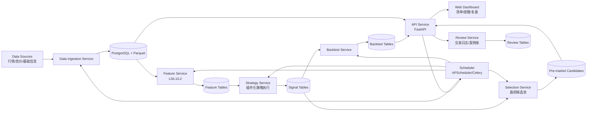
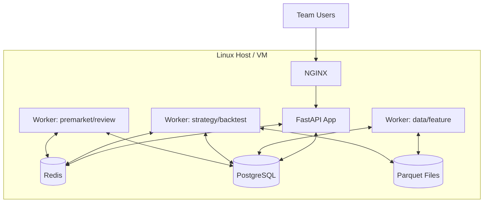

# OriBrink Architecture（2026 执行版）

## 1. 目标与原则

目标：
1. 支持“盘前量化初筛 + 人工决策把关”的稳定日常流程。
2. 支持策略快速迭代（新策略 7 天内从想法到回测）。
3. 支持结果可追溯（数据版本、策略版本、参数版本可回放）。

架构原则：
1. 分层解耦：数据、特征、策略、回测、应用分离。
2. 插件化：新增策略不改主流程。
3. 可观测：任务、数据质量、策略表现都可监控。
4. 先稳后快：先跑通最小闭环，再做性能优化。

## 2. 模块图



## 3. 数据流

### 3.1 日终数据流（T 日收盘后）
1. `data_ingestion_job` 拉取 T 日行情与竞价快照。
2. 写入 ODS（原始层）并做基础校验（缺失、重复、异常波动）。
3. 标准化到 DWD（标准层）：统一代码、交易日、复权口径。
4. 触发 `feature_compute_job` 计算 L0/L1/L2 特征。
5. 写入特征表并生成 `data_snapshot_version`。

### 3.2 盘前选股流（T+1 日开盘前）
1. `pre_market_job` 读取最近快照版本。
2. 调用策略插件批量生成信号并打分。
3. 聚合多策略结果，输出 20~50 支观察池。
4. 写入 `pre_market_candidates`，同时导出 CSV/API。

### 3.3 盘中辅助流
1. `intraday_watch_job` 订阅分钟数据或轮询。
2. 命中条件后生成提醒事件。
3. 前端显示提醒并允许人工打标（忽略/关注/执行）。

### 3.4 盘后复盘流
1. 执行者写入交易日志（含策略标签、理由、结果）。
2. `review_summary_job` 统计成功/失败/错过样本。
3. 生成周报与策略健康度报告。

## 4. 服务边界与职责

1. `data-service`
- 职责：接入、清洗、标准化、质量校验。
- 输出：`symbol_daily`、`symbol_intraday`、`auction_snapshot` 等。

2. `feature-service`
- 职责：L0/L1/L2 特征计算。
- 输入：标准化行情数据。
- 输出：`feature_l0_*`、`feature_l1_*`、`feature_l2_*`。

3. `strategy-service`
- 职责：统一策略执行接口，生成信号。
- 输入：特征数据 + 参数版本。
- 输出：`signal_results`。

4. `backtest-service`
- 职责：历史模拟、绩效评估、稳定性测试。
- 输入：策略版本 + 回测配置。
- 输出：`backtest_runs`、`backtest_trades`、`backtest_metrics`。

5. `selection-service`
- 职责：盘前多策略聚合与候选池生成。
- 输出：`pre_market_candidates`。

6. `review-service`
- 职责：交易日志、案例库、周月报。
- 输出：`manual_trade_logs`、`review_cases`、`weekly_reports`。

7. `api-service`
- 职责：对外统一接口，鉴权、查询、写入。

8. `web-dashboard`
- 职责：候选池浏览、提醒处理、复盘录入、报告查看。

## 5. 核心接口契约（建议先冻结）

```python
class DataProvider:
    def get_bars(self, symbols: list[str], start: str, end: str, freq: str): ...
    def get_auction(self, date: str): ...

class FeatureEngine:
    def compute(self, date: str, universe: list[str] | None = None): ...

class Strategy:
    name: str
    version: str
    def generate_signals(self, date: str, params: dict): ...

class Backtester:
    def run(self, strategy_version: str, start: str, end: str, config: dict): ...

class Selector:
    def build_watchlist(self, date: str, top_n: int = 50): ...

class ReviewLogger:
    def log_trade(self, payload: dict): ...
```

## 6. 部署图（单机起步，后续可水平扩展）



### 部署建议
1. 起步：`docker compose` 单机部署。
2. 稳定后：
- API 与 Worker 分离部署。
- PostgreSQL 独立主机或托管服务。
- Parquet 可迁移对象存储。

## 7. 任务编排（调度）

日常任务建议：
1. `18:00` `job_ingest_daily`
2. `18:30` `job_compute_features`
3. `21:00` `job_backtest_nightly`（仅启用策略）
4. `08:20` `job_pre_market_selection`
5. `09:20-11:30,13:00-15:00` `job_intraday_watch`
6. `15:30` `job_review_aggregate`
7. `周六` `job_weekly_report`

## 8. 可扩展点

1. 新策略扩展：新增策略文件 + 注册，无需改主流程。
2. 新数据源扩展：新增 adapter，实现 `DataProvider`。
3. 新评分模型扩展：在 selection 层新增融合器。
4. 新看板扩展：API 不变，前端可独立演进。

## 9. 可观测与运维

必须监控：
1. 任务成功率、耗时、失败原因。
2. 数据质量（缺失率、重复率、异常波动）。
3. 策略健康（近 20/60/120 交易日表现）。
4. API 可用性与慢查询。

告警建议：
1. 盘前任务失败或超时立刻告警。
2. 数据缺失超过阈值告警。
3. 策略连续失效触发降权提醒。

## 10. 技术选型（当前建议）

1. Python 3.11+
2. uv（依赖与命令执行）
3. FastAPI + Uvicorn
4. PostgreSQL 15+
5. Redis 7+
6. pandas/numpy/ta/vectorbt（或 backtrader）
7. APScheduler（起步）或 Celery（任务量变大后）

## 11. 标准运行命令（统一为 uv）

1. 初始化：`bash scripts/bootstrap.sh`
2. 启动依赖：`docker compose up -d`
3. 启动 API：`uv run oribrink-api`
4. 启动调度器：`uv run oribrink-scheduler`
5. 健康检查：`curl http://localhost:8000/health`
6. 代码检查与测试：
- `uv run ruff check .`
- `uv run mypy services shared`
- `uv run pytest`
